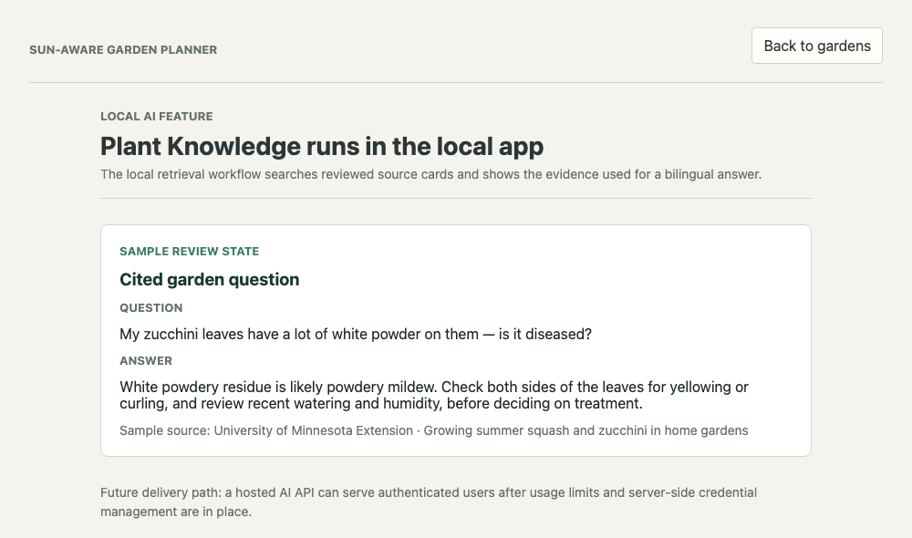

# Garden Manager

A full-stack garden operations and seasonal-planning application. It helps a
gardener organize multiple locations, visualize planting areas, record care,
plan the next season, and ask source-grounded plant questions.

**[▶ Open the live demo](https://garden-manager-demo.vercel.app)** — no install, no account. Select **Load demo garden** to explore a populated workspace.

`Next.js` `React` `TypeScript` `FastAPI` `Pydantic` `PostgreSQL` `SQLAlchemy` `Alembic` `pgvector` `Docker Compose` `GitHub Actions` `pytest` `Vitest` `Playwright`

## Screenshots

**Garden plan** — planting areas laid out on a real metric grid, with plants placed inside each area.


**Next season planner** — deterministic crop-family rotation guidance derived from what each area grew last season.


**Plant knowledge** — bilingual retrieval over curated source cards, with the supporting source shown next to every answer.



## What It Demonstrates

- **Garden operations:** multiple gardens, raised beds, in-ground areas, and
  container groups with measured planting layouts.
- **Current records:** plants, care history, recurring care tasks, and
  reviewable plant-health records.
- **Seasonal planning:** crop-family rotation guidance by growing area and a
  separate next-season plan with companion-planting notes.
- **Applied AI:** Chinese and English care-note extraction, local RAG-backed
  Plant Knowledge answers, visible citations, and user review before records
  are saved.
- **Reliable persistence:** automatic PostgreSQL sync, revision-checked saves,
  and explicit conflict resolution when another tab saves first.
- **Full-stack delivery:** Next.js, FastAPI, PostgreSQL, Alembic, pgvector,
  Docker Compose, GitHub Actions, Vitest, pytest, and Playwright.

## Five-Minute Demo

### Hosted demo (fastest)

Open the [live demo](https://garden-manager-demo.vercel.app), select **Load demo garden**,
then walk through steps 4-6 below. Garden, Care, and Season Planner are available
online; AI and photo workflows are shown as previews and run in the local app.
The API sleeps on the free tier, so the first request can take about a minute.

### Local (full feature set, including AI)

1. Start the API and database with `docker compose up --build`.
2. In another terminal, run `npm install`, then start the web app with `npm run dev`.
3. Open `http://localhost:3000` and select **Load demo garden**.
4. Double-click **Demo Garden** to inspect its measured growing areas and
   plant layout.
5. Return to the dashboard and open **Plan next season**. Review crop-family
   guidance, then add a crop to a growing area's next-season plan.
6. Open **Care** to create a task or record a completed care event.
7. After completing [Enable local AI features](#enable-local-ai-features), open
   **Plant knowledge** to ask a Chinese or English question and inspect the cited source cards.

The demo uses generic data and can be loaded repeatedly. It replaces the
gardens saved in the current browser workspace.

## Architecture

```text
Next.js + React + TypeScript
        |
        | typed workspace requests
        v
FastAPI + Pydantic
        |
        v
PostgreSQL + SQLAlchemy + Alembic + pgvector
        |
        +-- deterministic crop-rotation service
        +-- local AI extraction and plant-knowledge retrieval
```

The frontend renders measured growing-area layouts with React-Konva. Garden
data is created in the browser and synced to PostgreSQL automatically the first
time it changes; from then on PostgreSQL is the workspace's write source. Every
save carries a workspace revision, so a stale tab gets an HTTP 409 and a choice
to reload or overwrite instead of silently losing the other tab's work. The full data model
and trade-offs are documented in [Technical Architecture](docs/technical-architecture.md)
and the [Architecture Decision Records](docs/decisions/README.md).

## Local Setup

### Requirements

- Node.js 20 or later
- Docker Desktop
- Optional for local AI: [Ollama](https://ollama.com/)

### Start the application

```bash
docker compose up --build
```

In a separate terminal:

```bash
npm install
npm run dev
```

Open `http://localhost:3000`. The API documentation is available at
`http://localhost:8000/docs`.

### Enable local AI features

The local provider uses Ollama. Download the two models once:

```bash
ollama pull qwen3:4b
ollama pull embeddinggemma
```

Keep Ollama running and restart Docker Compose after downloading the models.
Care events and plant-health observations can also be entered manually. Plant
Knowledge answers require the configured embedding and answer models to be available.

## Verification

Frontend:

```bash
npm run lint
npm run typecheck
npm test
npm run build
```

End to end (real Chromium against the real Next.js app, FastAPI, and a fresh
migrated SQLite database on ports 3100/8100; first run needs
`npx playwright install chromium`):

```bash
npm run test:e2e
```

Backend (SQLite by default; point `TEST_DATABASE_URL` at a PostgreSQL database
to run the same suite plus the PostgreSQL-only concurrency tests):

```bash
cd backend
pytest
TEST_DATABASE_URL=postgresql+psycopg://garden@localhost:5433/garden_planner_test pytest
```

GitHub Actions runs frontend lint, type checks, tests, and build; the backend
suite twice (SQLite for speed, then a real PostgreSQL service so the
optimistic-locking `UPDATE` is verified on the production database); one
Playwright end-to-end flow (create a garden, save an edit, plan next season,
reload, and find both served back by the API); and a Docker health check on
pull requests and pushes to `main`.

## Product Boundaries

- The application supports a single-user workspace with PostgreSQL persistence.
  Account authentication and authorization remain outside the current release;
  use generic data in the public demo.
- The portfolio demo deploys Garden, Care, and Season Planner workflows on
  Vercel, Render, and Supabase. It uses generic data and keeps AI and photo
  features in the local app.
- Plant Knowledge uses a small curated source set with visible citations. It
  provides educational guidance and requests more detail when evidence is weak.
- Map-backed yard initialization and yard-wide sun analysis remain deferred
  research work. The operational garden workflow is the active product.

## Additional Documentation

- [Product Brief](docs/product-brief.md)
- [Technical Architecture](docs/technical-architecture.md)
- [Project Strategy](docs/project-strategy.md)
- [AI and RAG Design](docs/ai-rag-agent-design.md)
- [Portfolio Demo Deployment](docs/portfolio-demo-deployment.md)
- [Resume Positioning](docs/resume-positioning.md)
- [Architecture Decision Records](docs/decisions/README.md)
